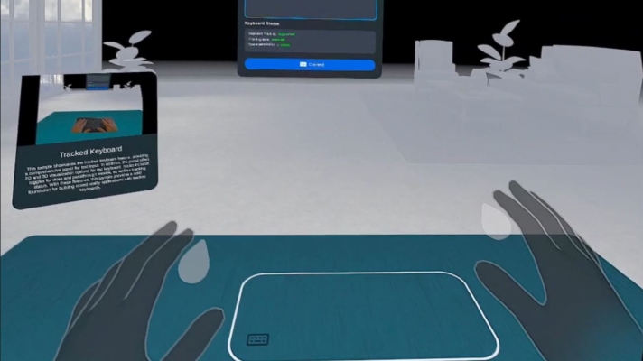

# Tracked Keyboard text input sample


This sample showcases the tracked keyboard feature, providing a comprehensive panel for text input. In addition, the panel offers 2D and 3D visualization options for the keyboard. It also includes toggles for desk and passthrough modes, as well as tracking status. With these features, this sample provides a solid foundation for building mixed reality applications with tracked keyboards.

See the [CONTRIBUTING](./CONTRIBUTING.md) file for how to help out.

## Licenses
The [MIT LICENSE](./LICENSE.txt) applies to the majority of the project, however files from [Text Mesh Pro](https://unity.com/legal/licenses/unity-companion-license) are licensed under their respective licensing terms.

## Prerequisites
* **Unity 2022.3+ LTS**.
* **Meta Quest OS v71 or above.**
* **Pair bluetooth keyboard** : On your Quest device, go to **Settings** > **Devices** > **Keyboard**. Enable keyboard tracking and pair your keyboard.

## Getting started

1. Clone this repo using either the green "**Code**" button above or this command in the terminal.
    ```sh
    git clone https://github.com/oculus-samples/Unity-TrackedKeyboard.git
    ```

    The repo is cloned to your computer. This may take a couple of minutes depending on your internet speed.

2. In Unity Hub, click **Add** > **Add Project from Disk** and select the **Unity-TrackedKeyboard** folder on your machine.
3. Open the project in **Unity 2022.3+ LTS**.
4. Open and play the **scene** located at [Assets/TrackedKeyboard/Scenes/TrackedKeyboard](Assets/TrackedKeyboard/Scenes/TrackedKeyboard.unity)
5. (**Optional**) If keyboard tracking is disabled, click the '**Connect**' button on the bottom of the panel to enable it directly from the application.
6. Play the scene in the editor or build and run an apk on your headset. You should now see a white outline around your tracked keyboard, and it should become visible when you bring your hands close to it.


## Integrating Tracked Keyboard within Your Own Project

### Prerequisites

* Interaction SDK v71 or above installed in your project.
* MR Utility Kit v71 or above installed in your project.
* Text Mesh Pro Essentials installed in your project.

### Integration Steps
1. Export the Tracked Keyboard package from the sample project (Assets/TrackedKeyboard/Scenes > right-click TrackedKeyboard Scene > Export Package).
2. Import the package into your personal project (double-click on the exported package and click Import).
3. Configure project settings: Meta > Tools > Project Setup > Fix All for Android and Standalone.
4. Test the scene in the editor.
5. Build and run on Android:
    * File > Build Settings... > switch to Android
    * Add the TrackedKeyboard scene (Add Open Scenes).
    * Ensure HMD is plugged in, then click Build and Run.

### Setting Up the Tracked Keyboard in Your Scene

1. Create an MRUK GameObject: Create a new GameObject in your scene and add the MRUK script to it. This will expose events for TrackableAdded/Removed.
2. Add the Tracked Keyboard Manager: Create a new GameObject and add the Tracked Keyboard Manager sample script to it. This script controls the tracked keyboard behavior in mixed reality.
3. Configure the Tracked Keyboard Manager: In the Inspector, assign the following:
    * Keyboard Prefab: Assign the prefab for the tracked keyboard.
    * Left Hand and Right Hand: Assign the left and right hand GameObjects.
    * Passthrough Layers: Assign the passthrough layers for underlay and overlay.
4. Set up Ray Interactors and Capsule Colliders: Configure the Ray Interactors in the OVRInteraction rig and add capsule colliders to detect hand proximity with the keyboard:
    * Go to CameraRig > TrackingSpace > LeftHandAnchor/RightHandAnchor.
    * Add a Capsule Collider component to each hand anchor.
    * Adjust the collider size and position to match your hand model.
5. Add PointableCanvasModule: Add the 'Custom Pointable Canvas Module' sample script to support mouse and keyboard input for ISDK UI Panels.
    * Note: The Custom Pointable Canvas Module is a temporary solution until the Interaction SDK fully supports mouse and keyboard input. Once ISDK support is available, this module can be removed.

#### Tips and Notes

* Make sure to assign all required references in the Tracked Keyboard Manager Inspector. Use the sample scene as a reference.
* The Tracked Keyboard Manager script uses events from the MRUK scripts to manage the tracked keyboard behavior.
* You can customize the appearance and behavior of the tracked keyboard by modifying the Keyboard Prefab and the boundary visual scriptable objects under Assets/TrackedKeyboard/ScriptableObjects/.

## Known Limitations

* Bad lighting conditions may affect keyboard tracking.
* Desk height is estimated based on the tracked keyboard's position and may not be accurate for all keyboard types.
